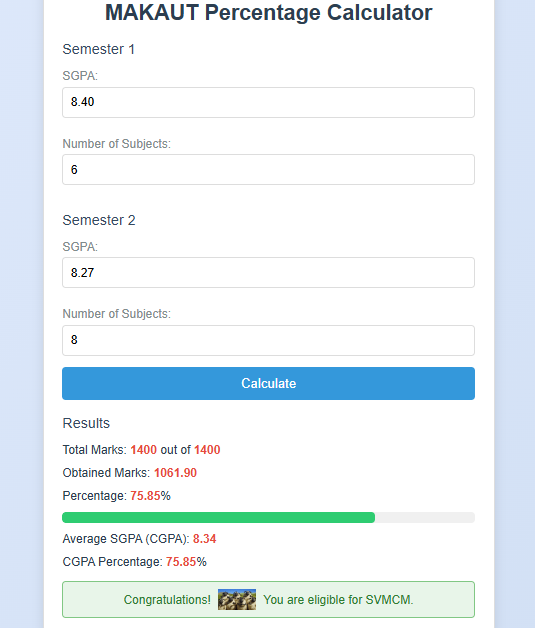
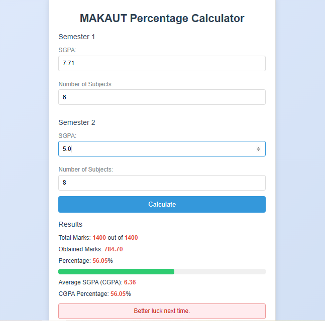

# makaut-percentage-calculator

 

  

Welcome to the MAKAUT Percentage Calculator, a simple and elegant web application designed to calculate your percentage, CGPA, and eligibility for the Swami Vivekananda Merit Cum Means Scholarship (SVMCM) based on your SGPA and number of subjects from MAKAUT (Maulana Abul Kalam Azad University of Technology) semesters. This tool provides a user-friendly interface with visual feedback, including a celebratory GIF for eligible students!

### Overview

 

  

This calculator helps MAKAUT students convert their Semester Grade Point Average (SGPA) into a percentage and Cumulative Grade Point Average (CGPA) using the official MAKAUT formula: (CGPA - 0.75) * 10. It also determines eligibility for the SVMCM scholarship (≥ 60% percentage) with a delightful congratulatory animation.

### Features

Accurate Calculations: Computes percentage, obtained marks, and CGPA based on SGPA and subject counts.
SVMCM Eligibility: Displays a message and GIF for students scoring 60% or above, with a supportive note for those below.
Interactive UI: Features a progress bar, modern design, and responsive layout for all devices.
Easy to Use: Simple input fields for SGPA and subjects per semester.
Deployable: Hosted online for free using platforms like Vercel

### Techstack

         
